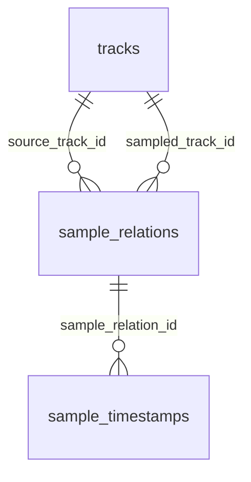

# Database: eerste contentmodel

Dit is de basis voor de scraper en admin. Vragen, games, spelers en scores krijgen
migrations bij de gameplay-stappen, wanneer hun concrete gedrag vastligt.

We gebruiken [Drizzle met node-postgres](https://orm.drizzle.team/docs/get-started/postgresql-new).
Het TypeScript-schema is de bron voor [gegenereerde SQL-migrations](https://orm.drizzle.team/docs/migrations).
De migrations worden bijgehouden in `packages/database/migrations` en door Drizzle
geregistreerd in de database. Dezelfde migration nogmaals uitvoeren verandert niets.

## Tracks en deduplicatie

Een track heeft een UUID, een verplichte unieke `canonical_key`, titel, artiest en
optionele album-, jaar-, artwork- en providergegevens. MusicBrainz-, Spotify- en
Apple Music-ID's en WhoSampled-URL's zijn ieder uniek wanneer ingevuld.

De importer moet een stabiele sleutel toewijzen aan dezelfde opname en bestaande
provider-ID's hergebruiken. De seed gebruikt bijvoorbeeld `dev:samplecheck:original-loop`.
De database doet zelf geen fuzzy matching op artiest/titel: verschillende versies
van een opname mogen niet onterecht samengevoegd worden. Normalisatie en het
oplossen van conflicterende provider-ID's horen bij de komende importerstap.

## Relaties en verificatie

Een relatie koppelt twee verschillende tracks. Elk gericht source/sampled-paar is
uniek. Een relatie groepeert alle sample-elementen en tijdstippen van dat paar;
we maken geen tweede relatie voor een extra timestamp. WhoSampled-ID en URL zijn
optioneel en uniek, zodat ook handmatige content mogelijk is.

`status` is de enige contentstatus: `IMPORTED`, `REVIEW_NEEDED`, `VERIFIED`,
`PUBLISHED` of `DISABLED`. Er is geen afzonderlijke `verified`-boolean.
De database vereist `verified_at` voor `VERIFIED` en `PUBLISHED`, plus `difficulty`
voor `PUBLISHED`. Dit vervangt geen menselijke review; de admin moet die later
afdwingen en de juiste statusovergangen uitvoeren.

De toekomstige question engine selecteert uitsluitend `PUBLISHED`. Publicatie
moet in de admin ook bruikbare fragmenten en playback controleren; dat is nog niet
geimplementeerd in deze schemastap.

## Timestamps

- Alle tijden worden als gehele milliseconden opgeslagen, met rol `SOURCE` of `SAMPLED`.
- De combinatie relatie, rol en tijd is uniek. Dezelfde tijd aan beide kanten mag.
- Per relatie en rol kan maximaal een timestamp `is_preferred = true` hebben.
- `confidence` is onbekend (`NULL`) of ligt tussen 0 en 1.
- Negatieve tijden en verwijzingen naar ontbrekende relaties worden geweigerd.
- Ruwe timestamp-tekst en `throughout` worden per kant op de relatie bewaard.
  `throughout` betekent niet automatisch een verzonnen timestamp van nul.

Bij een voorkeurwissel moet de admin binnen een transactie eerst de oude voorkeur
uitzetten en daarna de nieuwe aanzetten. De gedeeltelijke unieke index beschermt
ook tegen twee gelijktijdige keuzes.

Tracks die nog gebruikt worden kunnen niet verwijderd worden. Het verwijderen van
een relatie verwijdert bijbehorende timestamps; normaal schakelt de admin content
uit met `DISABLED`, zodat de data behouden blijft.

Alle tijdregistraties gebruiken PostgreSQL `timestamptz`. `updated_at` wordt bij
Drizzle-updates automatisch bijgewerkt. Bij handgeschreven SQL moet de schrijver
dit zelf instellen; er is geen database-trigger voor.

## Verbinding en ontwikkeldata

CLI-tools lezen de `.env` in de repositoryroot. `DATABASE_URL` heeft voorrang;
anders gebruiken ze dezelfde `POSTGRES_*`-waarden als Compose met host `127.0.0.1`.
In productie is `DATABASE_URL` verplicht. Apps krijgen de verbinding expliciet
via `createDatabase(url)` en sluiten de pool bij shutdown.

De ontwikkelseed is volledig fictief en doet geen externe requests. Hij draait in
een transactie en verandert bestaande tracks, reviews en voorkeuren niet. De seed
is geblokkeerd bij `NODE_ENV=production`. Hij levert geen audio of speelbare vragen.

De integratietests gebruiken unieke tijdelijke records en rollen hun transacties
terug. Ze resetten of wissen geen bestaande tabellen. Het schema moet vooraf met
`pnpm db:migrate` zijn aangelegd.
